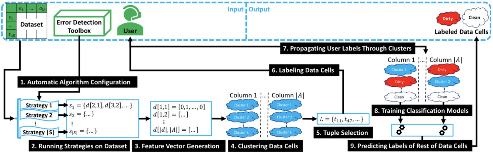

### Executive summary
Metadata-controlled data quality & data lineage along the production chain integrated with a laboratory information system for monitoring and quality documentation of various BoM & formulation variations in the biochemical production of active pharmaceutical ingredients (preliminary production of active ingredients in transplant medicine).

### Problem statement
Neither technical, nor rule based approaches can adequately help in raising data quality without domain expertise.
Using the domain expertise to create the rules is time consuming and often not feasible from the manpower perspective.

### Target market / Industries
The use case is applicable to any industry dealing with large volumes of data if insufficient quality, e.g.:
- Serial manufacturing
- Mass production
- Retail
- Financial services
- Cross-industry applications

### Solution
The approach is based on few shot manual learning, when the expert creates a few dozens of examples with real-life data. Later on from these examples the model learns strategies to identify and correct data quality errors.

##### Example Use Case Agent Cascade

### Stakeholders
- Domain experts
- Product data quality
- Functional experts
- Risk managers

### Data elements, Assets and Deliverables
As an Input from the client, the following items were used:
- Detailed data sets where the quality to be improved
- 20-30 examples of errors and their manual corrections
- Judgement on automated model performance

Assets & Artefacts:
- Ferris error correction toolbox

The deliverables included:
- Customized data quality improvement workflow

### Impact and benefits
The use case implementation allows to address data quality issues in an efficient manner with high quality of the process automation. If the data quality management process would remain manual, this would result in 5-6 Full Time Employees dedicated for this task. The Machine Learning model will over time accumulate respective knowledge and support domain expertise with relevant automated data quality improvement proposals.
