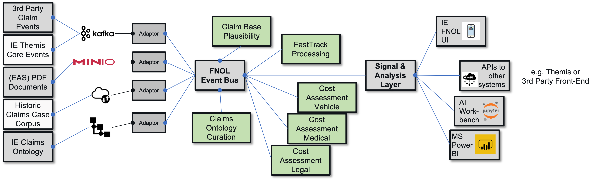

### Executive summary
The handling of cross-jurisdictional accident resolutions involving more than one country was automated for a pan-European insurance group. 

### Problem statement
The client was bound to a proprietary existing legacy core system which served all operational processes but did not lend itself to agile, digital use cases. Within the cross-jurisdictional context various third-party party core systems of partner network insurers also had to be integrated in the overall flow. In addition to already digital content, file-based and even handwritten forms of the European Accident Standard had to be taken into account. The growth of the customer did not allow for a continued manual processing.

### Target market / Industries
Focused on Industry segments, but easily configured to work for similar case management related processes that involve expert knowledge combined with extensive manual fact checking.

### Solution
The customer wanted to automate and streamline the handling and ideally straight-through-processing of new cases whenever the context allowed for such an option and involve the correct stakeholders when a human resolution was called for. An existing data warehouse provided historic resolution data that could be used to train various Machine Learning (ML) models. In addition, a knowledge graph contained the expertise on how the company wanted to deal with certain constellations in the future. 

The solution included:
- Ingestion of all relevant base data into a use case message bus
- Automated plausibility check of the base claim (e.g. policy paid, client = driver, counterparty validity)
- ML model to assess "Fast Track" options (depending on likely cost footprint)
- Helper ML models to assess cost for vehicle, medical and legal cost
- Curation model to extend "fast track" rules within knowledge graph

##### Example Use Case Agent Cascade

### Stakeholders
- Head of Operations / Claims Handling
- Domain Expert for Motor Vehicle Accidents Underwriting
- Domain Expert from Accounting & Controlling
- Tech Expert for mobile field agent application
- Tech Expert for core system 

### Data elements, Assets and Deliverables
As an Input from the client, the following items were used:
- Core data items on policies, clients, risk vs. claim details
- Core data from insurance partner network
- Historic claims & claim resolution data warehouse 

Assets & Artefacts:

- Claims knowledge graph & ontology
- Vehicle, medical and legal cost assessment prediction models
- Fast track viability assessment model
- Ontology curation / extension model 

The deliverables included:
- Automated decisioning on human vs. straight-through-processed case handling

### Impact and benefits
The use-case implementation resulted in:
- the client was able to manage a +35% annual growth with fewer headcount (-3 FTE)
- turnaround times of automated cases could be reduced by >90%, from 8-10 working days to 1 day
- turnaround times of manual cases could be reduced by 30% due to elimination of manual triage 
- the initial use case paved the way for additional AI based automation ideas

### Testimonials
> "We were sceptical about the limits of automation with rather difficult data quality we initially set out with. The learning loop for both the agents involved as well as the predicition models was a true surprise to me."
— Mr. Okatwiusz Ozimski, Inter Europe AG
